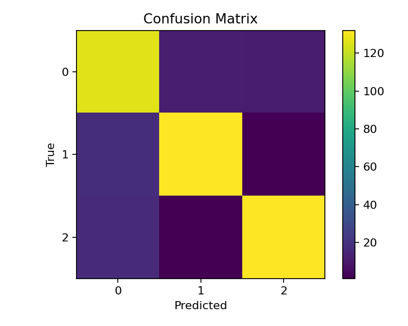
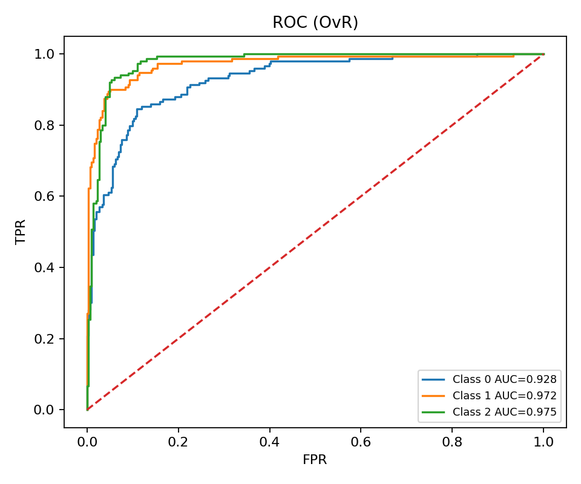
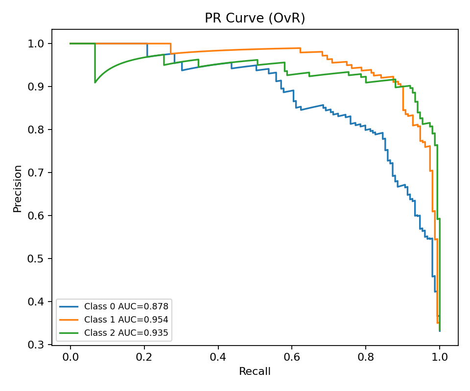
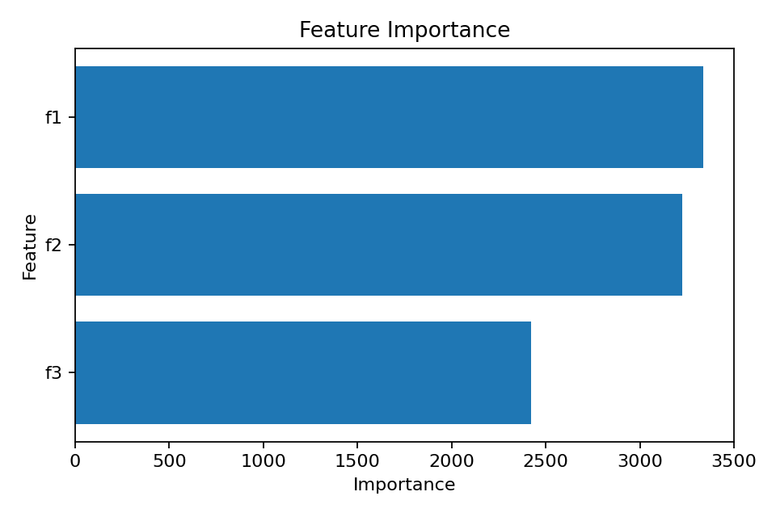
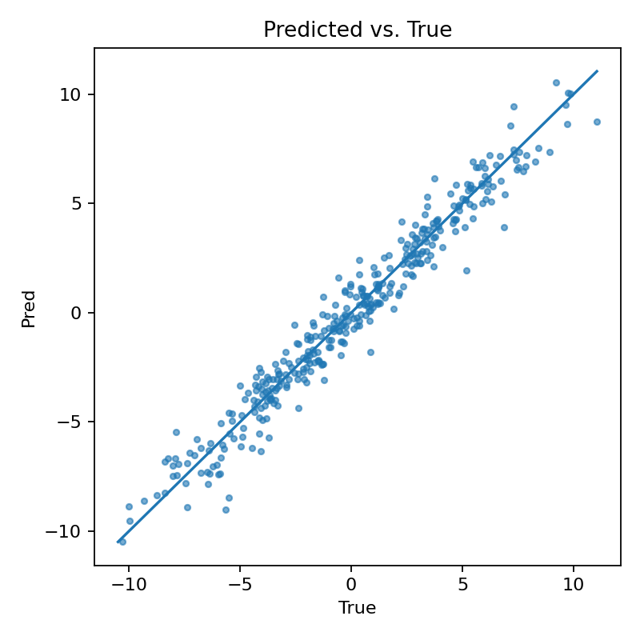
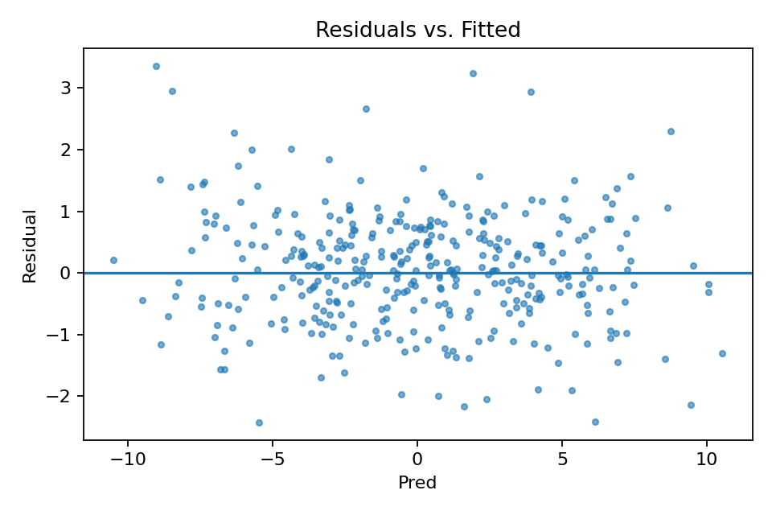
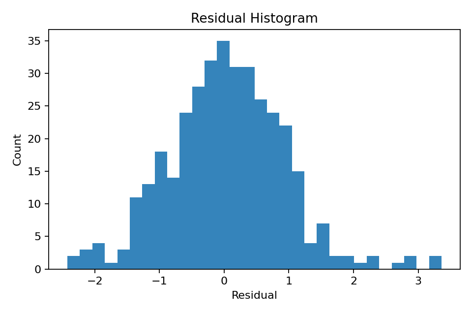
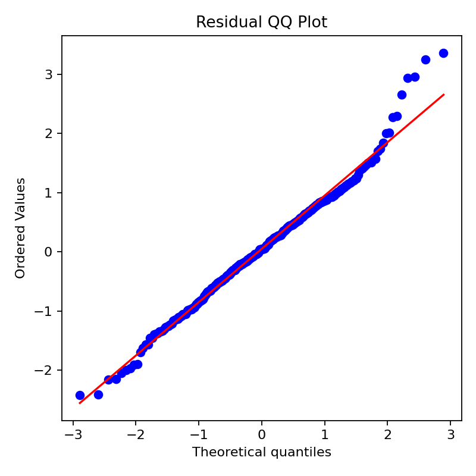

# MLDS Divvy Forecast — End-to-End Debug & Baseline Pipeline

> Reproducible “bronze→silver→model→reports” pipeline for Divvy/GBFS bike data. Includes synthetic test harness, LightGBM baselines for classification & regression, and ready-to-publish artifacts (plots, metrics, environment files).

---

## TL;DR (copy–paste run)

**Windows (PowerShell / Conda Prompt)**

```powershell
# create env (once)
conda create -n citybikes-311 -y -c conda-forge python=3.11 numpy pandas scikit-learn pyarrow lightgbm matplotlib
conda activate citybikes-311

# run classification (3-class) + regression with plots
python scripts\debug_check.py --task clf --classes 3 --mode signal --rows 1500 --seed 42 --train-size 0.7 --plots cm,roc,pr,fi --bronze-dir data\bronze --silver-dir data\silver --reports-dir reports
python scripts\debug_check.py --task reg --mode signal --rows 1200 --seed 42 --train-size 0.7 --plots fi,resid,pred,qq,hist --bronze-dir data\bronze --silver-dir data\silver --reports-dir reports
```

**Git workflow (feature branch → PR)**

```bash
git fetch origin
git switch main && git pull
git switch -c feat/full-publish-debug-check
# run the two commands above to generate artifacts
conda env export -n citybikes-311 --from-history > environment.yml
python -m pip freeze > requirements.txt
git add -A
git commit -m "feat: publish debug_check pipeline + artifacts + env files"
git push -u origin feat/full-publish-debug-check
# then open PR on GitHub and merge after review
```

---

## Data Sources (APIs)

Live GBFS (General Bikeshare Feed Specification) endpoints for Divvy:

* Root (discovery):
  `https://gbfs.divvybikes.com/gbfs/gbfs.json`
* Typical English feed endpoints:

  * `https://gbfs.divvybikes.com/gbfs/en/system_information.json`
  * `https://gbfs.divvybikes.com/gbfs/en/station_information.json`
  * `https://gbfs.divvybikes.com/gbfs/en/station_status.json`
  * `https://gbfs.divvybikes.com/gbfs/en/system_alerts.json`

Historical trips (CSV, monthly partitions):

* Divvy Tripdata S3 index:
  `https://divvy-tripdata.s3.amazonaws.com/index.html`

Chicago Data Portal (alternative structured access):

* Divvy Trips (Socrata API):
  `https://dev.socrata.com/foundry/data.cityofchicago.org/68dc-dswq`

> This repo ships a synthetic “debug” harness so you can validate the whole stack without external calls. Swap in GBFS/tripdata ingestion later.

---

## What This Project Implements

**Data Engineering Pattern**

* **Bronze → Silver**:

  * *Bronze*: raw CSV drops for quick inspection/lineage.
  * *Silver*: typed, column-cleaned **Parquet** via **PyArrow** for analytics/ML.
* **Deterministic synthetic generators** for quick CI-friendly runs:

  * `--mode signal` yields learnable structure.
  * `--mode noise` yields near-random baselines for sanity checks.

**Modeling**

* **Classification (multiclass)**: `LightGBM` (`LGBMClassifier`)

  * Metrics: Accuracy, Macro-F1, LogLoss
  * Plots: Confusion Matrix, ROC (one-vs-rest/AUC), PR Curves, Feature Importance
* **Regression**: `LightGBM` (`LGBMRegressor`)

  * Metrics: R², MAE
  * Plots: Feature Importance, Predicted vs True, Residuals, Residual Histogram, QQ plot

**Reproducibility**

* Train/test split with `--seed` and `--train-size`.
* Frozen env snapshots: `environment.yml`, `requirements.txt`.
* All artifacts saved to `reports/` for audit and PR review.

---

## Repository Structure

```
.
├── scripts/
│   └── debug_check.py        # single entrypoint CLI (v2)
├── data/
│   ├── bronze/               # synthetic CSV (generated)
│   └── silver/               # Parquet silver tables (generated)
├── reports/                  # metrics & figures (generated)
│   ├── confusion_matrix.png
│   ├── roc.png
│   ├── pr.png
│   ├── fi.png
│   ├── pred_vs_true.png
│   ├── residuals.png
│   ├── residual_hist.png
│   ├── qq.png
│   ├── preds.csv
│   ├── preds_reg.csv
│   ├── classification_report.txt
│   ├── confusion_matrix.csv
│   ├── model_lgbm.txt        # dumped LightGBM trees
│   └── debug_report.json     # single JSON summary
├── environment.yml
├── requirements.txt
└── README.md
```

---

## How to Run

### 1) Environment

```powershell
conda create -n citybikes-311 -y -c conda-forge python=3.11 numpy pandas scikit-learn pyarrow lightgbm matplotlib
conda activate citybikes-311
```

> If you prefer `pip`: `python -m pip install -U numpy pandas scikit-learn pyarrow lightgbm matplotlib`

### 2) Classification (3-class)

```powershell
python scripts\debug_check.py `
  --task clf `
  --classes 3 `
  --mode signal `
  --rows 1500 `
  --seed 42 `
  --train-size 0.7 `
  --plots cm,roc,pr,fi `
  --bronze-dir data\bronze `
  --silver-dir data\silver `
  --reports-dir reports
```

Produces (under `reports/`):

* `confusion_matrix.png`, `roc.png`, `pr.png`, `fi.png`
* `preds.csv`, `confusion_matrix.csv`, `classification_report.txt`
* `model_lgbm.txt`, `debug_report.json`

### 3) Regression

```powershell
python scripts\debug_check.py `
  --task reg `
  --mode signal `
  --rows 1200 `
  --seed 42 `
  --train-size 0.7 `
  --plots fi,resid,pred,qq,hist `
  --bronze-dir data\bronze `
  --silver-dir data\silver `
  --reports-dir reports
```

Produces:

* `fi.png`, `pred_vs_true.png`, `residuals.png`, `residual_hist.png`, `qq.png`
* `preds_reg.csv`, `model_lgbm.txt`, `debug_report.json`

### 4) One-liners (Windows)

```powershell
python scripts\debug_check.py --task clf --classes 3 --mode signal --rows 1500 --seed 42 --train-size 0.7 --plots cm,roc,pr,fi --bronze-dir data\bronze --silver-dir data\silver --reports-dir reports ; `
python scripts\debug_check.py --task reg --mode signal --rows 1200 --seed 42 --train-size 0.7 --plots fi,resid,pred,qq,hist --bronze-dir data\bronze --silver-dir data\silver --reports-dir reports
```

### 5) Git Branch & PR

```bash
git fetch origin
git switch main && git pull
git switch -c feat/full-publish-debug-check
# run both jobs above to generate reports/
conda env export -n citybikes-311 --from-history > environment.yml
python -m pip freeze > requirements.txt
git add -A
git commit -m "feat: publish debug_check pipeline + artifacts + env files"
git push -u origin feat/full-publish-debug-check
# open PR: https://github.com/<your-user>/mlds-divvy-forecast/pull/new/feat/full-publish-debug-check
```

---

## CLI Reference

```text
usage: debug_check.py [-h]
  [--bronze-dir BRONZE_DIR] [--silver-dir SILVER_DIR] [--reports-dir REPORTS_DIR]
  [--mode {signal,noise}] [--task {reg,clf}] [--classes CLASSES]
  [--rows ROWS] [--skip-fit] [--seed SEED] [--train-size TRAIN_SIZE]
  [--plots PLOTS] [--horizon HORIZON] [--bronze BRONZE] [--silver SILVER] [--reports REPORTS]
```

Key flags:

* `--task {reg,clf}`: choose regression vs classification
* `--classes N`: number of classes (≥2) for classification
* `--mode {signal,noise}`: learnable vs pure-noise generator
* `--plots`: comma-separated; classification → `cm,roc,pr,fi` ; regression → `fi,resid,pred,qq,hist`
* `--seed`, `--train-size`: reproducibility & split ratio
* `--bronze-dir`, `--silver-dir`, `--reports-dir`: output locations

All outputs are summarized in **`reports/debug_report.json`**.

---

## Models & Methods (short explainer)

* **LightGBM**: gradient-boosted decision trees with histogram-based splits.

  * Pros: fast, handles non-linearities and feature interactions, robust to scaling.
  * Classification: soft-probabilities (LogLoss), class-balanced Macro-F1, confusion matrix.
  * Regression: bias/variance inspection via residual plots, QQ for normality check, R²/MAE for fit quality.
* **Evaluation Design**: deterministic `train_test_split` with `random_state=seed`.
* **Feature Space (synthetic)**:

  * informative `x1, x2, x3` (signal mode) with controlled noise;
  * class logits or regression target crafted to be learnable under GBDT;
  * baseline “noise mode” to confirm metrics degrade as expected.

> Swap the synthetic generator with GBFS/tripdata ingestion to build real station-level demand or availability classifiers/regressors. The “bronze→silver→model” contract stays unchanged.

---

## Sample Results (from `reports/`)

**Classification**

* Confusion Matrix
  
* ROC Curves
  
* Precision–Recall
  
* Feature Importance
  

**Regression**

* Predicted vs True
  
* Residuals
  
* Residual Histogram
  
* QQ Plot
  

> Exact values depend on the random seed and row count; see `reports/debug_report.json` for metrics and file paths.

---

## Extending to Real Divvy Data

1. **Ingest GBFS**: poll `station_status.json` at a cadence (e.g., 1–5 min), join with `station_information.json` for metadata; write bronze CSV, then silver Parquet with typed schema.
2. **Labeling**:

   * *Classification*: occupancy class, outage detection, rebalancing needs, etc.
   * *Regression*: bikes-available forecast horizon, demand nowcasting.
3. **Features**: rolling window stats per station, time-of-day/weekday, weather joins, geography, events.
4. **Validation**: temporal splits, backtests, and leakage-safe feature generation.

---

## Troubleshooting

* **“No further splits with positive gain” warnings**:
  Normal on tiny synthetic sets or overly simple trees; increase `rows`, allow deeper trees, or ensure `--mode signal`.
* **Plots missing**:
  Ensure `matplotlib` is installed and `--plots` includes the desired figures.
* **Windows path quirks**:
  Use raw strings or forward slashes for custom paths; keep `reports/` and `data/` relative to repo root.
